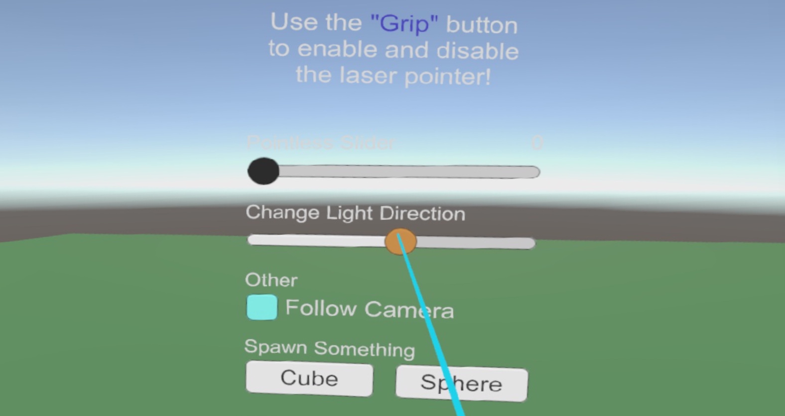
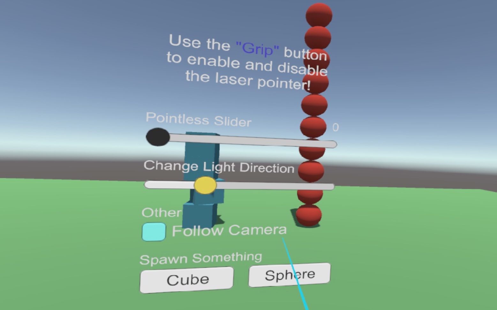

# Unity-VRPointerVive

This repository is based on the following:  
https://github.com/wacki/Unity-VRInputModule

The goal is a laser pointer for a VR experience with HTC Vive using Unity and SteamVR 2.0.  
To achieve this, some scripts had to be modified.  
Also, this repository will only focus on the HTC Vive with SteamVR.  

 

# How To Setup

## 1. Option: Using SteamVR "Player" Prefab

If you are using the prefab provided by Valve,  
simply add the `LaserPointerInputModule` script to the game object `InputModule` inside the "Player" prefab.  
There is already a `EventSystem` script attached to it.  
Ensure to enable `Send Navigation Events` on it.  

After that, you can add the `ViveUILaserPointer` script to the desired controller/hand.  
They are usually located here in the editor game object hierarchy: *Player/SteamVRObjects/*.  
Their name is either `LeftHand` or `RightHand`.  
**INFO:** You don't have to add the script directly to them if you want!  
You can simply add the script to any game object.  
But something **you always have to do** is selecting the desired controller on the script!  

## 2. Option: Own Setup

Ensure you use Valve's `Hand` script for your controllers  
and that you add the `LaserPointerInputModule` script to the game object that holds an `EventSystem` component!  

After that, you can add the `ViveUILaserPointer` script to the desired controller/hand as explained in "Option 1".

 

# Possible Issues

> I created a new scene and added the script but nothing is working!

Well, there could be several reasons for this.  
One important thing that could be responsible for this behaviour is that  
there is no `EventSystem` component attached to the game object you have the `LaserPointerInputModule` attached to.  
Another one could be that there are multiple `EventSystem` components in the scene  
that prevent the call of the `Process` function.  

 

# Updates

## Status 18.11.2018

- code modied to function as supposed.  
- added **enable/disable feature** for the laser pointer  
- added sample scene (see `Scenes` folder) 

## Status 17.11.2018

The code and functionality is currently not tested.  
Testing and improvements will follow in some days.  
